<picture>
  <source media="(prefers-color-scheme: dark)" srcset="assets/banner-dark.svg" />
  
</picture>

  

 

J'audite, je durcis et j'automatise la sécurité d'applications déjà construites.
Je livre aussi des projets complets de bout en bout, seul : architecture, code,
pipeline, déploiement, exploitation.

> [!IMPORTANT]
> **Je ne livre pas qu'un rapport.** Chaque faille corrigée est prouvée par un test,
> et un contrôle en CI empêche qu'elle revienne.

 

## Offres

<table>
<tr>
<td width="50%" valign="top">

#### 🔍 &nbsp;Audit applicatif

Revue de code orientée exploitation, selon l'**OWASP Top 10:2025** et l'**ASVS 5.0**.
Django/DRF, FastAPI, Next.js, Flutter, Solidity.

**→ Rapport priorisé par exploitabilité réelle.**

</td>
<td width="50%" valign="top">

#### ⚙️ &nbsp;CI/CD sécurisé

SAST, SCA, scan de secrets et analyse IaC intégrés au pipeline,
plutôt qu'un contrôle en fin de chaîne.

**→ Merge bloqué au-delà d'un seuil de sévérité.**

</td>
</tr>
<tr>
<td width="50%" valign="top">

#### 🛡️ &nbsp;Hardening infrastructure

Ubuntu LTS, UFW + Fail2Ban, SSH par clés uniquement, Nginx avec CSP, HSTS
et rate limiting, Certbot, conteneurs non-root et multi-stage.

**→ Surface d'attaque réduite.**

</td>
<td width="50%" valign="top">

#### 🎯 &nbsp;Triage de vulnérabilités

Une CVE critique jamais atteinte par un chemin d'exécution passe après
une injection moyenne sur un endpoint public.

**→ Priorités fixées par l'exploitabilité, pas par le score CVSS brut.**

</td>
</tr>
</table>

 

## Méthode

| 1 · Diagnostic | 2 · Rapport | 3 · Correction | 4 · Garde-fou |
|:--|:--|:--|:--|
| Cause racine identifiée avant toute modification. | Failles classées par exploitabilité réelle. | Corrigée, puis prouvée par un test. | Contrôle ajouté en CI pour bloquer la régression. |

<b>Principes de travail</b>

 

**Diagnostic avant correction. Toujours.**
Un symptôme n'est pas une cause. Je remonte à la cause racine avant d'écrire une ligne,
sinon on corrige le même bug trois fois sous trois formes différentes.

**Pas de macroplanning.**
Le problème est découpé en actions courtes, chacune avec un critère de validation binaire.
On avance quand c'est prouvé (compilation, test, log), pas quand ça a l'air de marcher.

**Honnêteté sur le risque.**
Si une décision d'architecture a un angle mort, je le dis avant, pas au post-mortem.
Si un délai est intenable, je le dis à la signature, pas à la livraison.

**Fait, estimation, opinion : toujours distingués.**
Une version, un article de loi, une CVE : sourcé, ou pas affirmé.

 

## Le contexte ouest-africain, concrètement

C'est la partie que les prestataires hors zone traitent mal, ou pas du tout.

| Sujet | Ce que ça change |
|:--|:--|
| **Paiement** | Stripe n'ouvre pas de compte marchand aux entreprises établies au Bénin. On passe par des agrégateurs locaux comme FedaPay ou Kkiapay, et le moyen dominant est le Mobile Money, pas la carte. Le parcours de paiement, la gestion des échecs et la réconciliation changent, pas seulement le nom du prestataire. |
| **Données personnelles** | Un traitement au Bénin relève de la **loi n° 2017-20 portant Code du numérique** et de l'**APDP**. Dès que vous servez aussi des personnes dans l'Union européenne, le RGPD s'ajoute : deux régimes à satisfaire en même temps. |
| **Réseau** | Connexion instable, forfait data compté : budget de performance, dégradation gracieuse, pas de bundle de 3 Mo. |

 

## Stack

| Domaine | Outils |
|:--|:--|
| **Backend** |        |
| **Frontend** |     |
| **Infra** |      |
| **Sécurité** | `Semgrep` `Bandit` `Trivy` `OSV-Scanner` `Gitleaks` `TruffleHog` `Checkov` |
| **Mobile & blockchain** |   |

 

## Activité

  

<picture>
  <source media="(prefers-color-scheme: dark)" srcset="https://github-readme-activity-graph.vercel.app/graph?username=g0sh5ukuna&hide_border=true&bg_color=00000000&color=768390&line=0969da&point=0969da&area=true&area_color=0969da" />
  
</picture>

---

### Un audit, une mission, une question ?

Décrivez votre application, votre stack et votre contexte.

